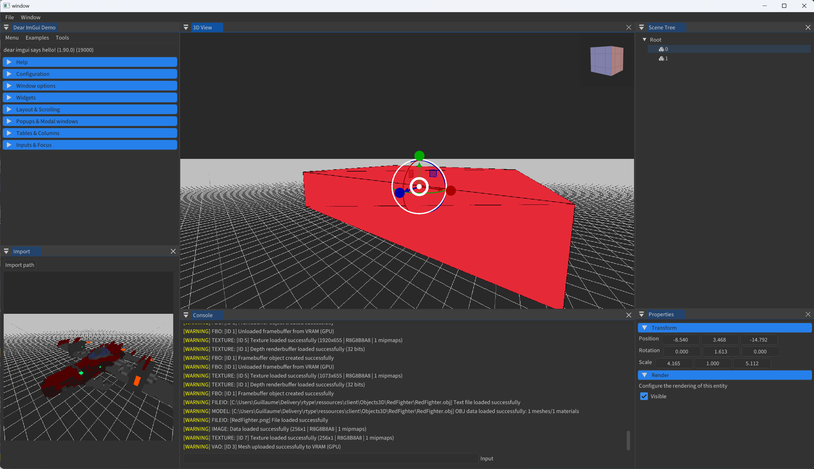

# R-Type Remastered

Welcome to R-Type Remastered, an exciting reimagination of the classic arcade shooter. This project is a testament to modern C++ capabilities, featuring a multithreaded server and dynamic client for an immersive multiplayer experience.

> [!NOTE]  
> Find the whole documentation on our [website](https://rtype.guillaume-hein.fr/).

## Project Overview

### Game Engine

Quick video of the game engine in action with Jolt Physics

https://github.com/Thyodas/rtype/assets/53176398/425d7935-3e52-4b3d-b9bd-701120994e2d

Interface screenshot

### Client

https://github.com/Thyodas/rtype/assets/53176398/2d6a7a5f-9ad2-435a-88c5-36cfdcd72b80

## Documentation Quick Links

- **Game Engine Architecture**: Detailed design principles of our engine [Game Engine Documentation](docs/ecs/README.md).
- **Network Protocol**: Our custom protocol specifications [Network Documentation](docs/network/RFC0001.md).

## External Dependencies

To run this project, ensure you have the following:
- **Adobe ImGui**: For a user-friendly interface.
- **Raylib 5.0**: For robust graphics handling.
- **rlImGui**: To integrate ImGui with Raylib.
- **Boost**: For various functionalities including networking.
- **CMake**: Necessary for building the project from source.

## Installation

Cloning and building is a breeze:
1. Clone the repository.
2. Run the `./build.sh` script or use the CMake commands for a manual build.
3. Start the server with `./server` from the root directory.
4. Launch the client by executing `./client`, also at the root directory.

For detailed instructions, visit our [Installation Guide](docs/install/README.md).

Prepare for an unparalleled gaming experience!

## The Team

R-Type Remastered is brought to life by a dedicated team of third-year students from Epitech Strasbourg:
- Mehdy Morvan
- Guillaume Hein
- Rémi MERGEN
- Jean Cardonne
- Nathan De Balthasar de Gachéo
- Alex Di Venanzio

This project is part of our curriculum, showcasing our collective skills in advanced software development with modern C++.

We thank Epitech for the opportunity to work on such an engaging project and for the support throughout our educational journey.
