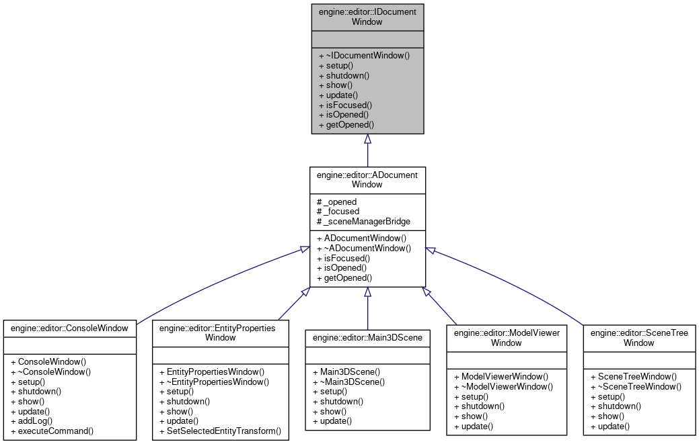

\page editor_readme Engine Editor
# Engine Editor

## Table of Contents

- [Engine Editor](#engine-editor)
  - [Table of Contents](#table-of-contents)
    - [The Editor](#the-editor)
    - [Editor Interface](#editor-interface)
    - [Editor Windows UML](#editor-windows-uml)

### The Editor

The editor is a tool that allows you to create and edit game objects and scenes.

It is built using the game engine itself, so it is a good example of what can be done with it.

### Editor Interface

The editor interface is built using ImGui.

It is composed of a menu bar, a scene view, and a hierarchy view.

### Editor Windows UML

